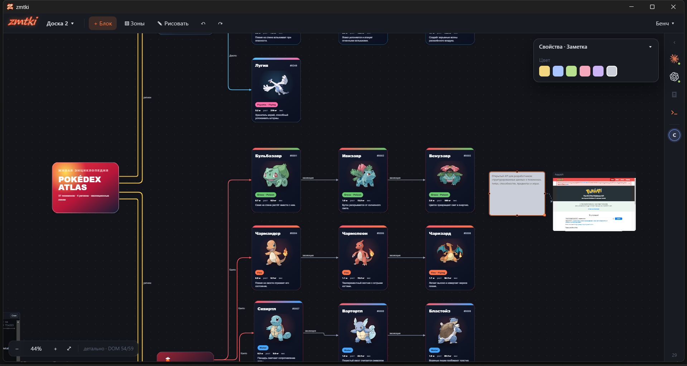
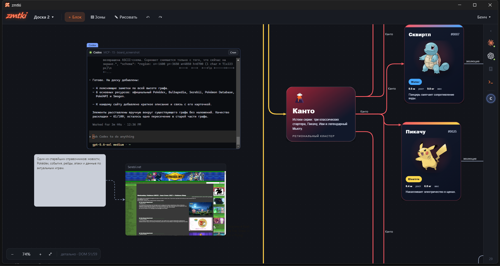
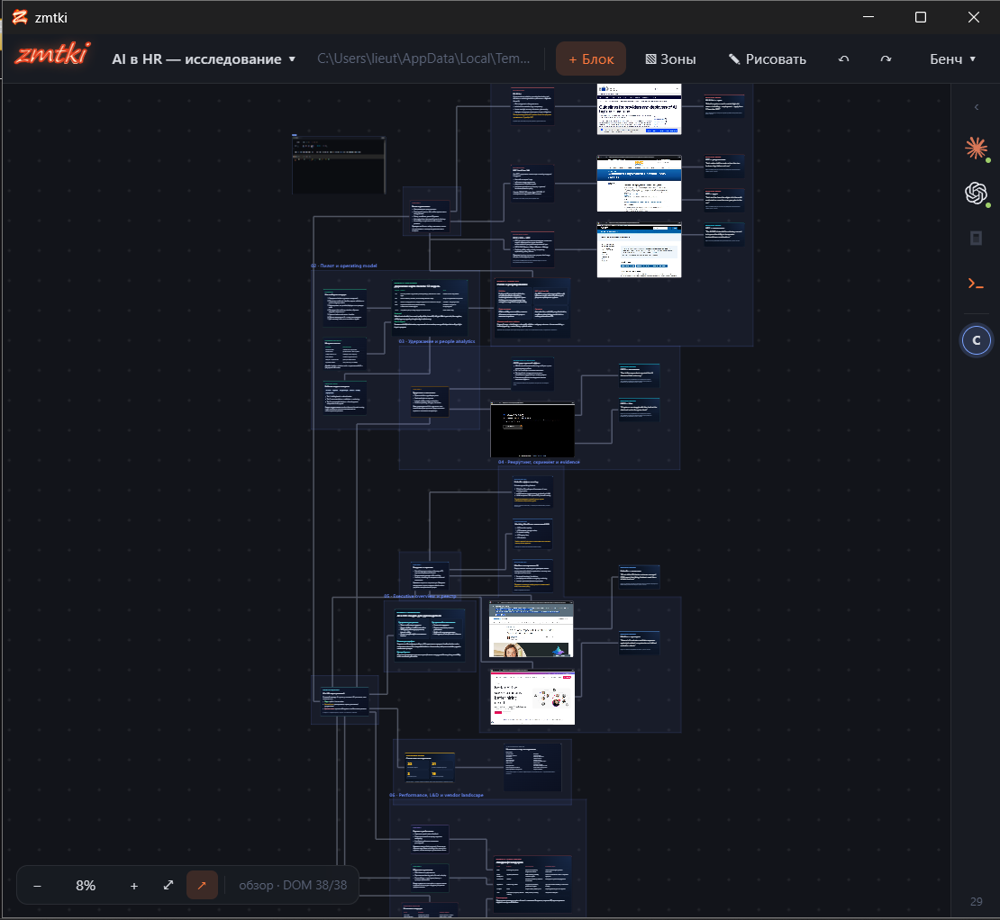
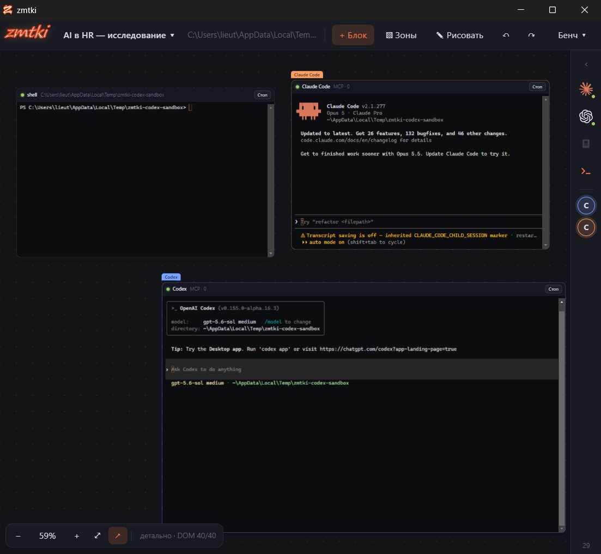

# zmtki

Бесконечная доска, на которой работают CLI-агенты. Заметки, документы, живые сайты,
терминалы и стрелки между ними — и Claude Code, Codex или OpenCode, которые сидят
в терминалах прямо на доске и правят её через MCP у вас на глазах.



## Что это

Обычная доска — место, куда человек складывает мысли. Здесь у доски два пользователя:
человек и агент, и оба видят одно и то же состояние.

- **Агент живёт на доске.** Перетащите харнесс из панели справа — на доске появится
  терминал с запущенным CLI. Он уже подключён к доске по MCP: 29 инструментов —
  создать артефакт, провести стрелку, разложить граф, попросить зону, снять скриншот.
- **Всё происходит на виду.** Блоки проявляются, сдвигаются вместе со стрелками,
  удалённые сжимаются. Где агент работает сейчас — видно по рамке и пунктиру к его
  терминалу.
- **Доска остаётся вашей.** Зону под работу, субагента и кнопку агент может попросить,
  но не взять сам. Вы принимаете или отклоняете.

## Как это выглядит

Агент строит доску, пока вы смотрите. Слева — его терминал с отчётом, справа —
то, что он только что разместил, включая живой сайт-источник:



Исследование на 37 карточек, 38 подписанных стрелок и 6 зон, собранное агентом
за 18 минут рядом с собственным терминалом. Шесть карточек — настоящие вкладки Chrome с источниками:



Харнессы рядом: обычная оболочка, Claude Code и Codex — каждый в своём терминале
на доске, с отметкой MCP и счётчиком вызовов:



## Возможности

### Артефакты

22 типа блоков: `note`, `text`, `markdown`, `document`, `markdown-doc`, `code`,
`code-editor`, `text-editor`, `html`, `ui`, `webview`, `browser`, `image`, `video`,
`audio`, `terminal`, `app-stream`, `button`, `kanban`, `shape`, `drawing`, `file`.

Из них живут своей жизнью:

| Тип | Что это |
| --- | --- |
| `terminal` | настоящий PTY; с `harnessId` — запущенный CLI-агент |
| `browser` | вкладка установленного Google Chrome, кадры идут по CDP |
| `webview` | страница в отдельном процессе Electron |
| `html`, `ui` | своя разметка в песочнице; агент рисует карточку целиком |
| `code-editor`, `text-editor`, `markdown-doc` | CodeMirror поверх файла на диске |
| `app-stream` | окно другого приложения, транслируемое на доску |

Файлы с диска можно просто перетащить в окно: картинки, видео, аудио, markdown
и код становятся блоками.

### Стрелки и раскладка

Стрелки прокладываются ортогонально и разводятся по портам, чтобы параллельные
линии не сливались. Движок раскладки умеет разложить связный граф по слоям
(`board_arrange_graph`) и оценить результат (`board_quality`,
`board_check_intersections`). Агент сам решает, считать координаты руками или
отдать раскладке, — правило выбора записано в его системном промпте.

### Зоны

Прямоугольные области с названием и цветом; несколько прямоугольников объединяются
в одну зону с общим контуром. Агенту можно назначить зону: пока она назначена, всё,
что он разместит за её границами, отменяется, а он получает объяснение, как
попросить расширение.

### Производительность

Доска рассчитана на тысячи артефактов. Камера не ходит через React: весь ввод
сводится в один кадр, который пишет трансформацию напрямую в DOM. Далеко от
курсора карточки заменяются одним canvas-слоем.

Замер на доске из 5000 артефактов и 4166 стрелок (`npm run bench -- 5000`):

| | |
| --- | --- |
| средний FPS | 59 |
| 95-й процентиль кадра | 16.9 мс |
| худший кадр | 50 мс |
| карточек в DOM одновременно | до 152 |

### Инструменты агентов

Кроме доски агенту можно выдать готовые MCP-серверы — галочками в панели справа.
Сейчас в каталоге Playwright: агент сам открывает страницы, кликает, заполняет формы
и читает текст. Подключается к агентам, запущенным после включения.

## Установка

### Что нужно заранее

- **Node.js 20 или новее** — [nodejs.org](https://nodejs.org). Проверить: `node -v`.
- **Google Chrome** — только для блоков `browser`. Путь можно задать в `ZMTKI_CHROME`.
- Компилятор C++ **не нужен**: PTY ставится готовым бинарником.

Агенты — отдельно и по желанию. Приложение работает и без них, находит их само:

| Агент | Где ищется |
| --- | --- |
| Claude Code | PATH, `~/.local/bin`, `~/.claude/local`, расширение VS Code / Cursor |
| Codex | PATH, `~/.codex/bin`, расширение ChatGPT для VS Code / Cursor |
| OpenCode | PATH |

Доступность видно в панели справа: у найденного — отметка `MCP`, у ненайденного — «нет».

### Запуск

```bash
git clone https://github.com/JGSnapp/zmtki.git
cd zmtki
npm install
npm run dev
```

`npm install` ставит зависимости всех пакетов монорепозитория и докачивает
готовый бинарник PTY. Первый `npm run dev` собирает main и preload, поднимает
Vite для рендерера и открывает окно.

Запуск из терминала VS Code тоже работает: скрипт снимает `ELECTRON_RUN_AS_NODE`,
с которым Electron не открывает окно, а ведёт себя как обычный Node.

### Сборка

```bash
npm run build     # main, preload и рендерер в out/
```

## Проверки

```bash
npm test                # 202 теста: движок раскладки, дельты, зоны, тулы, MCP по HTTP
npm run typecheck

npm run e2e             # 23 проверки: перетаскивание, анимации, инерция, агент через MCP
npm run e2e:blocks      # 19: Chrome на доске, вебвью, редакторы файлов, медиа с диска
npm run e2e:zones       # 20: зоны, запрос зоны агентом, разрешение на субагента
npm run e2e:embeds      # 10: доска из 42 встроенных документов не мигает и держит кадр
npm run e2e:load        # 10: окно отвечает, пока агент строит и раскладывает граф
npm run e2e:html-freeze # карточки держат снимок на время жеста

npm run bench -- 5000   # замер FPS на доске из 5000 артефактов
```

E2E-проверки поднимают настоящее окно Electron и работают в нём мышью и клавиатурой,
а не в jsdom: часть из них сравнивает пиксели композита окна, а не то, что рендерер
думает о себе.

## Управление

| Действие | Как |
| --- | --- |
| Новый блок | «+ Блок» → тянуть на доску, или нажать и кликнуть по месту; Esc — отмена |
| Агент или терминал | тянуть метку харнесса из правой полосы на доску |
| Панель агентов | полоса справа; `‹` раскрывает её с настройками, `›` сворачивает обратно |
| Файлы | перетащить из проводника: картинки, видео, аудио, markdown и код становятся блоками |
| Настройки блока | выделить блок — панель «Свойства» справа сверху |
| Панорама | колесо, перетаскивание фона (с инерцией), средняя кнопка, пробел + мышь |
| Зум | Ctrl + колесо (относительно курсора), кнопки HUD, `0` — 100%, `F` — вписать всё |
| Стрелки при отдалении | кнопка `↗` в HUD: видны на общем плане или пропадают вместе с карточками |
| Выделение | клик, Shift + клик, Shift + рамка по фону, Ctrl + A |
| Стрелка | выделить артефакт и тянуть с точки на стороне на другой артефакт |
| Заметка | двойной клик по фону |
| Редактирование текста | двойной клик по тексту |
| Работа внутри терминала, страницы, редактора | сначала выделить артефакт кликом |
| Удалить / отмена / повтор | Delete / Ctrl + Z / Ctrl + Shift + Z |
| Рисование | выделить «Рисунок», нажать `D` |
| Зоны | «▧ Зоны» или `Z`: протяжка — зона, ещё протяжка — она растёт, Shift + протяжка — вырез |
| Правка зоны | клик по названию: ✎ переименовать, кружки — цвет, ✕ удалить; Esc — выйти из режима |
| FPS | `F3` |

## Агенты

Перетащите Claude Code или Codex из панели «Запустить на доске» туда, где он должен
работать. В терминале агент уже подключён к доске по MCP (`board`): инструменты доски,
зоны, субагенты и кнопки, системный промпт движка раскладки и каталог скиллов приходят
ему при подключении.

### Что агент может попросить, но не может взять сам

| Просьба | Как это выглядит |
| --- | --- |
| Зона под работу (`zone_request`) | зона появляется подсвеченной, с пояснением «зачем»; вы принимаете или отклоняете |
| Субагент (`agent_spawn`) | баннер в панели «Агенты»: кто просит, зачем, «Разрешить» / «Отклонить» |
| Кнопка на доске (`button_set`) | кнопка появляется, но нажимаете её вы; команда всегда переспрашивает |

Сколько субагентов агенту разрешено и нужно ли спрашивать каждый раз — переключатели
в его карточке в панели «Агенты» (по умолчанию: не больше двух и спрашивать всегда,
у самого субагента — ноль).

### Скиллы

Каталог скиллов приходит агенту при подключении, тело — по `skill_get`. Встроенных три:
раскладка набора артефактов, построение графа и карточки с разметкой. Скиллы можно
править и добавлять свои; изменённый встроенный больше не перезаписывается обновлением.

## Устройство

Монорепозиторий npm workspaces:

```
packages/shared     геометрия, роутинг стрелок, раскладка, зоны — без DOM и Electron
apps/desktop
  src/main          процессы: доски, агенты, харнессы, PTY, Chrome по CDP, MCP-сервер
  src/preload       мост в рендерер; Node в рендерере выключен
  src/renderer      React: канвас доски, камера, артефакты, панели
  src/shared        типы IPC
```

Данные лежат в `%APPDATA%/@zmtki/desktop/data` (Windows) или в каталоге из
`ZMTKI_DATA_DIR`: `boards.json`, `skills.json`, `settings.json`, `mcp-servers.json`.

Иконка — `apps/desktop/resources/icon.png`; после замены
`npm run icons -w @zmtki/desktop` пересобирает `icon.ico`.

## Документы

- [VISION.md](VISION.md) — что строим и зачем
- [PLAN.md](PLAN.md) — этапы и итерации
- [docs/ITERATION-04.md](docs/ITERATION-04.md) — текущая итерация
- [docs/ITERATION-03.md](docs/ITERATION-03.md), [docs/ITERATION-02.md](docs/ITERATION-02.md), [docs/ITERATION-01.md](docs/ITERATION-01.md) — предыдущие
- [docs/PROVENANCE.md](docs/PROVENANCE.md) — что откуда взято
- [docs/UPSTREAM-PORTS.md](docs/UPSTREAM-PORTS.md) — что перенесено из плейграунда
